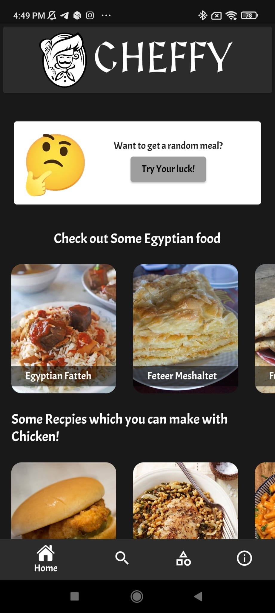
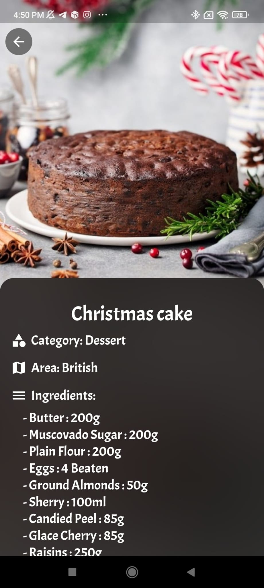
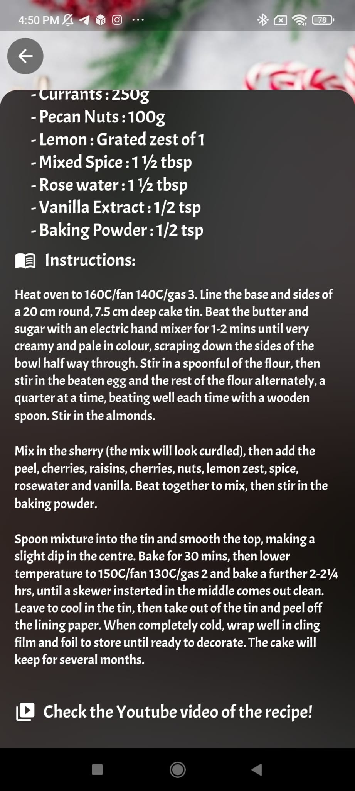
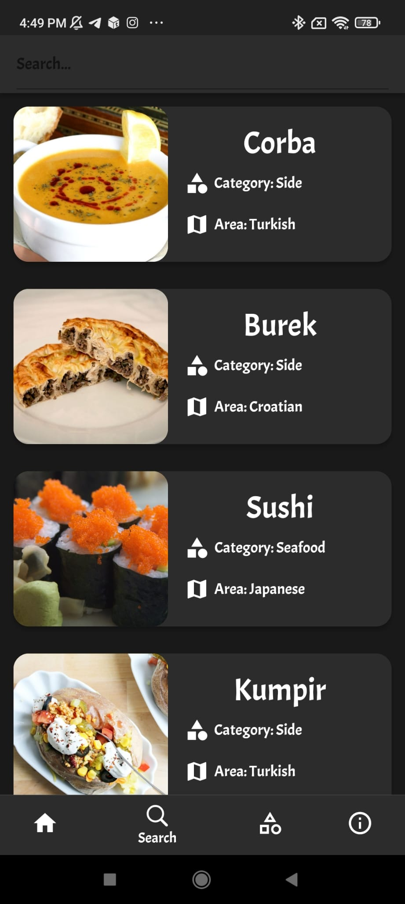
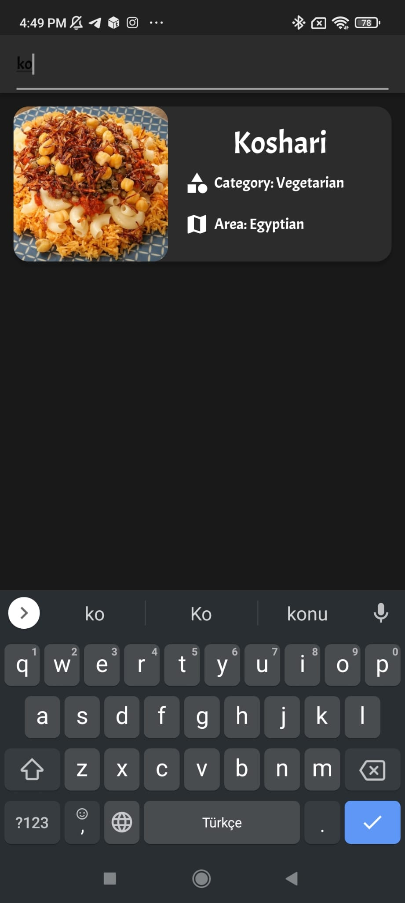
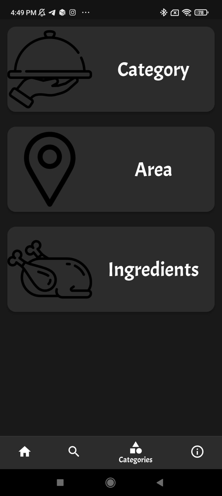
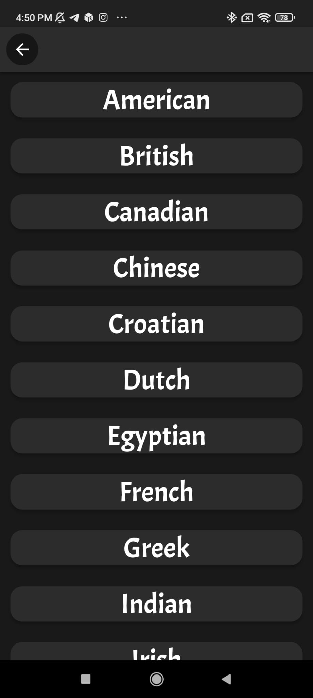

# Cheffy

***Cheffy*** :spaghetti: provides recipes and other useful information for Many delicious dishes!. You can Search for whatever Recipe comes to your mind and also filter out recipes according to diffrent aspects!.

### Flutter Concepts:

- Navigate to Diffrent sites using *[url_launcher](https://pub.dev/packages/url_launcher)*.
- Accessing Api Data *GET* using Flutter  *[Http Package](https://pub.dev/packages/provider)**
- Navigating through multiple screens and argument passing.
- Flutter widgets (stateless and stateful) and styling.

## Features
- getting a random meal if you want to try your luck :wink:.
- Simple and Catchy UI :heart_eyes:.
- Search for whatever meal you want :mag:.
- Filtter By (Area,Category,Ingredients) :open_mouth: .
- Youtube Video link for every meal :tv:.

## Screenshots

***Note***: App requires internet to access the database/API.

**API WEBSITE**: *[THE MEALDB](https://www.themealdb.com/)*
